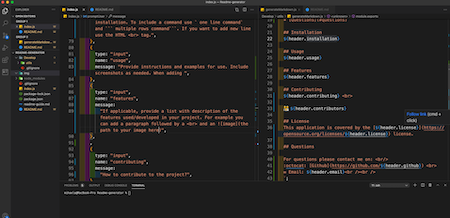

  <h1 align="center">  README Generator </h1> 

  ## Description 
  
<i>This project was developed with the purpose to generate well structured Readme.md file from the command line. Through this application, developers are able to include sections like proje</i>
  

  ## Table of Contents 
  * [Installation](#installation)
  * [Usage](#usage)
  * [Features](#features)
  * [Contributing](#contributing)
  * [License](#license)
  * [Questions](#questions)
  
  ## Installation
  Follow the folowing instructions to install this project:   1. Download Nodejs to you computer.   2. Clone the project repo to your computer   `git clone git@github.com:mihaelavalac/Readme-generator.git`   3. Navigate to the root of the project through your text editor. 

  ## Usage 
  This is a nodejs application that runs in the command line :   

  ## Features
  This is a nodejs application that runs in the command line :   

  ## Contributing
  To contribute to the project just install it on your computer, add the desired features/changes and push it back to the git. I will review the changes ans merge them in the main branch  

  👪 Mihaela Valac
  
  ## License
  This application is covered by the [GPL-2.0](https://opensource.org/licenses/GPL-2.0) license. 
  
  ## Questions

  For questions please contact me on:  
  :octocat: [Github](https://github.com/mihaelavalac)  
  ✉️ Email: mihaelavalac@yahoo.com  
  